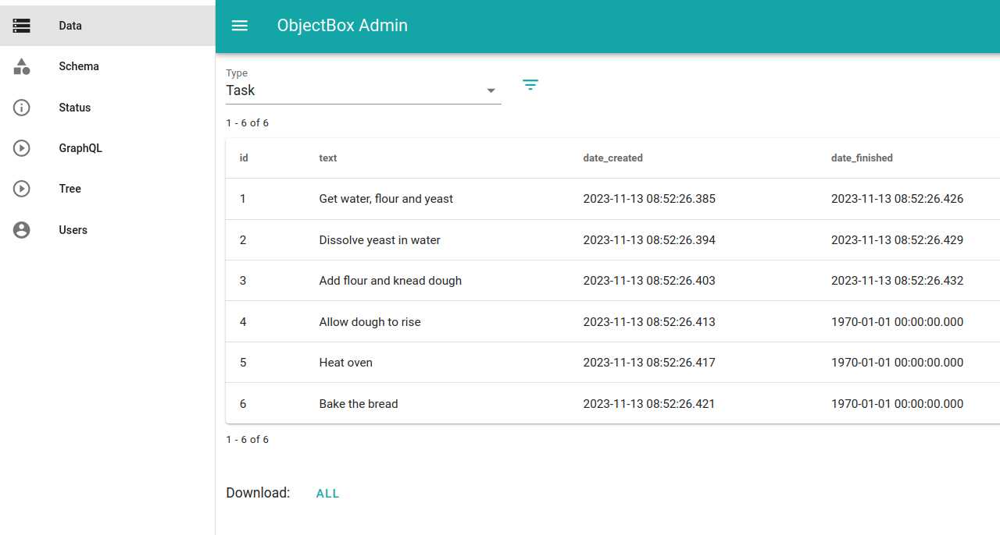
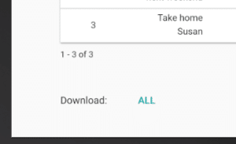

# ObjectBox Admin

## ObjectBox Admin Web App

The ObjectBox Admin web app allows you to

* view data objects and schema of your database inside a regular web browser,
* display additional information,
* and download objects in JSON format.

Admin comes in two variants: as a standalone [desktop app (Docker image)](data-browser.md#run-via-docker) and embedded in the [Android](data-browser.md#admin-for-android) library.

The web app runs directly on your device or on your development machine. Behind the scenes, this is done by embedding a lightweight HTTP server into ObjectBox. It runs completely local (no Cloud whatsoever) and you can simply open the Admin in your Browser.

<figure><figcaption><p>The Admin web app with the Data page open.</p></figcaption></figure>

## Run via Docker

To run Admin on a desktop operating system, e.g. your development machine, you can launch ObjectBox Admin instantaneously using the official [ObjectBox Admin Docker image](https://hub.docker.com/r/objectboxio/admin) `objectboxio/admin`.\
\
**This requires a running Docker Engine or Docker Desktop.** If not done, install and start [Docker Engine](https://docs.docker.com/engine/) (Linux, Windows/WSL2) or [Docker Desktop](https://docs.docker.com/get-docker/) (Windows, macOS) capable of running a Linux/x86\_64 image.



**Recommended, but the below script needs to be run from a Linux distribution (for example Ubuntu through WSL2 on Windows) or macOS. To run from Windows PowerShell, see the "Run Docker manually" tab.**


`objectbox-admin.sh` Shell Front-End for ObjectBox Admin Docker Image


Download the script `objectbox-admin.sh` via the link above. Make it executable (e.g. `chmod +x objectbox-admin.sh`). Copy it to some place (e.g.`/usr/local/bin`) and then run it.

Then you can have a quick look at the options of the script:


```bash
$ objectbox-admin.sh --help

usage: objectbox-admin.sh [options] [<database-directory>]

<database-directory> ( defaults to ./objectbox ) should contain an objectbox "data.mdb" file.

Available (optional) options:
 [--port <port-number>] Mapped bind port to localhost (defaults to 8081)
```


Basically you can optionally select the path to an ObjectBox database and the mapping of the local HTTP port (e.g. to open multiple Admins to analyze multiple databases).

So to run the script, either change to the directory where the `objectbox` directory with the database file `data.mdb` exists:

```bash
cd objectbox-c/examples/cpp-gen
objectbox-admin.sh
```

Or pass the path to it as an argument:

```
objectbox-admin.sh objectbox-c/examples/cpp-gen
```

If you see the error `failed: port is already allocated.` try to use a different local port. E.g. to use port `8082`:

```
objectbox-admin.sh --port 8082
```

Note: If you run the script for the first time Docker will download the ObjectBox Admin image automatically from Docker Hub. If run again the download is skipped as the image has been cached in your local image repository.



The Docker image is available at `objectboxio/admin` on Docker Hub. We recommend to use the `latest` tag.

**Linux/macOS/Windows WSL2 command line**


```shell
docker run --rm -it --volume /path/to/db:/db -u $(id -u):$(id -g) --publish 8081:8081 objectboxio/admin:latest
```


Replace `/path/to/db` with the actual path to the directory containing the `data.mdb` file.

If you need to **use a different local port** other than 8081, modify the first number of `-p` accordingly. E.g. `-p 8082:8081` lets you open the web-app at `http://localhost:8082`.

**Windows PowerShell/Command Prompt**

Note: Make sure Docker Desktop runs [with WSL2 instead of Hyper-V](https://docs.docker.com/desktop/install/windows-install/).


```powershell
docker run --rm -it --volume C:\path\to\db:/db --publish 8081:8081 objectboxio/admin:latest
```


Replace `C:\path\to\db` with the actual path to the directory containing the `data.mdb` file. Note this uses Windows-style backslashes.

Note the user id (`-u`) mapping is omitted on Windows. The port can be changed as written above.



Once Admin has started, open the local URL printed by the script (typically `http://127.0.0.1:8081`) in your browser. You should see the Data page for an entity type.


For database files stored on a Windows file system (NTFS), to see changes to the database, Admin needs to be restarted.



## Admin for Android


Works for Android apps built with ObjectBox for Java or Flutter


We strongly recommend using Admin **only for debug builds** as it ships with additional resources and configuration not intended for production code.



Modify the app's Gradle build file to add the dependency and change **the “io.objectbox” plugin to be applied after the dependencies block:**


```java
dependencies {
    // Manually add objectbox-android-objectbrowser only for debug builds,
    // and objectbox-android for release builds.
    debugImplementation("io.objectbox:objectbox-android-objectbrowser:$objectboxVersion")
    releaseImplementation("io.objectbox:objectbox-android:$objectboxVersion")
}

// Apply the plugin after the dependencies block so it picks up 
// and does not add objectbox-android.
apply plugin: 'io.objectbox'
// Or using Kotlin DSL:
apply(plugin = "io.objectbox")
```


If the plugin is not applied afterwards, the build will fail with a duplicate files error (like `Duplicate files copied in APK lib/armeabi-v7a/libobjectbox.so`) because the plugin fails to detect and adds the `objectbox-android` library.



Modify the Gradle build file of the Flutter Android app to add the dependency:


```groovy
// Tell Gradle to exclude the Android library (without Admin)
// that is added by the objectbox_flutter_libs package for debug builds.
configurations {
    debugImplementation {
        exclude group: 'io.objectbox', module: 'objectbox-android'
    }
}

dependencies {
    // Add the Android library with ObjectBox Admin only for debug builds.
    // Note: when the objectbox package updates, check if the Android
    // library below needs to be updated as well.
    // TODO Replace <version> with the one noted in the release notes (https://github.com/objectbox/objectbox-dart/releases)
    debugImplementation("io.objectbox:objectbox-android-objectbrowser:<version>")
}
```


To avoid a version mismatch on updates, we suggest to change the dependency on the objectbox Dart package from an open to a fixed version as well:

```yaml
dependencies:
  # Note: when updating objectbox, check the release notes (https://github.com/objectbox/objectbox-dart/releases)
  # if objectbox-android-objectbrowser in android/app/build.gradle has to be updated.
  objectbox: x.y.z # TODO Replace with valid version
  objectbox_flutter_libs: any
```



Finally, after creating the store, to start Admin:



Create an `Admin` instance and call `start`:

```java
boxStore = MyObjectBox.builder().androidContext(this).build();
if (BuildConfig.DEBUG) {
    boolean started = new Admin(boxStore).start(this);
    Log.i("ObjectBoxAdmin", "Started: " + started);
}
```



Create an `Admin` instance and keep a reference, optionally close it once done using the web app:

```dart
if (Admin.isAvailable()) {
  // Keep a reference until no longer needed or manually closed.
  admin = Admin(store);
}

// (Optional) Close at some later point.
admin.close();
```



<details>

<summary>Info: added Android manifest permissions</summary>

For your information, these are the permissions the `objectbox-android-objectbrowser` dependency **automatically adds** to `AndroidManifest.xml`:

```xml
<!-- Required to provide the web interface -->
<uses-permission android:name="android.permission.INTERNET" />
<!-- Required to run keep-alive service when targeting API 28 or higher -->
<uses-permission android:name="android.permission.FOREGROUND_SERVICE"/>
<!-- When targeting API level 33 or higher to post the initial Admin notification -->
<uses-permission android:name="android.permission.POST_NOTIFICATIONS"/>
```

If the dependency **is only used in debug builds** as recommended above, these permissions will **not be added to your release build.**

</details>

### Browse data on your test device

When Admin is started it will print the URL where to access the web app to the logs, e.g. something like:

```
ObjectBox Admin running at URL: http://127.0.0.1:8090/index.html
```

The URL can be opened on the device or emulator. To open the web app on your dev machine, see the instructions below.

For ObjectBox for Java, the app also displays a notification to access Admin. (Don't see the notification on Android 13 or newer? Try to manually turn on notifications for the app!) Tapping it will launch a service to keep the app alive and opens the Admin web app in the web browser on the device.

Stop the keep-alive service from the notification.

### Browse data on your dev machine

To open the web app on your development machine find the Admin URL log message as noted above.

Then, on your dev machine, [use the ADB command to forward the port](https://developer.android.com/studio/command-line/adb#forwardports) (or whichever you like) to that port of your device. If the default port 8090 is used, the command looks like this:

```bash
adb forward tcp:8090 tcp:8090
```

Then open the web app URL in a web browser on your dev machine.

## Download Objects

To download all objects of the currently viewed box tap the download all button at the very bottom. The exported data is in JSON format.

<figure><figcaption><p>The download option for objects.</p></figcaption></figure>

