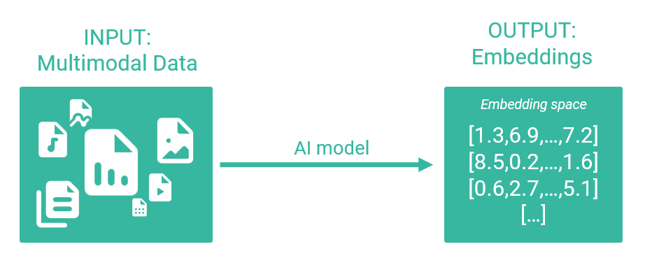
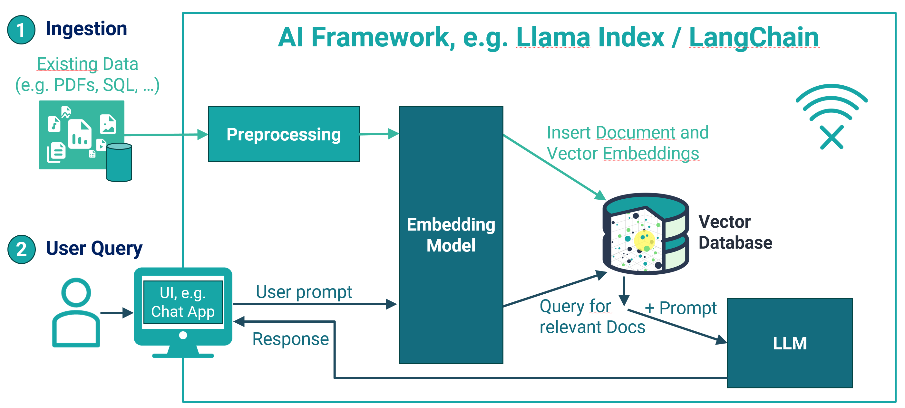

# On-Device Vector Search


Vector Search is currently available for Python, C, C++, Dart/Flutter, Java/Kotlin and Swift. Other languages will follow soon.


**Vector search** is the task of searching for objects whose vector is near to a given input query vector. Applications include semantic/similarity search (often performs better than full text search (FTS)), multi-modal search (text, images, video), recommendation engines and various use cases in AI.

You can use ObjectBox as a plain vector database and store only vectors and IDs. Or, you can have your entire data model stored in ObjectBox since it is also a full database. Choose anything in between that best suits your needs.

To use ObjectBox as a vector database follow these 3 simple steps:

1. Define your data model along with a vector index,
2. Insert your data/vectors,
3. Search for nearest neighbors.

## An Example: Cities and their Location

To illustrate these steps, we will use a simplified example using cities throughout the next sections. Each city has a location expressed as latitude and longitude. And thus, we can search cities that are close to a certain point.

<figure><figcaption></figcaption></figure>

In the diagram above, let's look at which are the closest cities to the red point, which is located at latitude 53.0 and longitude 15.0. One can intuitively see that Berlin is closest, followed by Copenhagen and Vienna. In search terms, Berlin, Copenhagen and Vienna are the 3 nearest neighbors to the given point.

A city's location has only 2 dimensions, which is easy to grasp. While even 3D space can still be quite intuitive, we humans typically have a hard time when dimensions increase beyond that. But this is exactly where vector databases shine: they handle high-dimensional data with typically hundreds or thousands of dimensions.

## Data Model and Vector Index

In order to enable efficient vector search, a vector database needs to "index" the data. This is true for ordinary data too, just that a vector index is a "special" index. ObjectBox relies on Hierarchical Navigable Small Worlds (HNSW), a state-of-the-art algorithm for approximate nearest neighbor (ANN) search that performs very fast and is very scalable.


**Hierarchical Navigable Small Worlds (HNSW)** _- Background Information_

HNSW spans a graph over all vectors by connecting each vector node to its closest neighbors. To search for the nearest neighbors of a given vector, you start at an arbitrary node and check which of its neighbors are closer to the given vector. This repeats until the closest nodes are identified. To make this scalable, HNSW uses layers: higher layers have less nodes to get closer to the destination vector faster. Once the closest node in a layer is identified, the algorithm moves down one layer. This repeats until the lowest layer which contains all nodes is reached and the actual approximate nearest neighbors are found.

**Approximate nearest neighbor (ANN) search**: with high-dimensional vectors, exact nearest neighbor search is extremely time consuming (see also: [curse of dimensionality](https://en.wikipedia.org/wiki/Curse\_of\_dimensionality)). Thus, approximate solutions like HNSW are the way to go in this domain. Typically, they come with a quality/performance trade-off. In the case of HNSW you have parameters to control that.


If you are interested in scientific details, check out the [HNSW paper](https://arxiv.org/abs/1603.09320).


Defining the data model in ObjectBox is straight-forward: in one of the supported programming languages, declare a City class and "annotate" (tag) it as an ObjectBox "Entity" (a persistable object type; check the [Getting started](getting-started.md) guide for details). The class shall have the following members (properties): an obligatory ID, a name, and a location. The latter is expressed as a vector; after all we want to demonstrate vector search. This vector only has 2 dimensions: latitude and longitude.

So, this is what a City data class with an HNSW index definition can look like:



```python
@Entity()
class City:
    id = Id
    name = String
    location = Float32Vector(index=HnswIndex(
        dimensions=2,
        distance_type=HnswDistanceType.EUCLIDEAN
    ))
```



```dart
@Entity()
class City {
  @Id()
  int id = 0;

  String? name;

  @HnswIndex(dimensions: 2)
  @Property(type: PropertyType.floatVector)
  List<double>? location;
  
  City(this.name, this.location);
}
```



```java
@Entity
public class City {
    @Id 
    long id = 0;

    @Nullable 
    String name;

    @HnswIndex(dimensions = 2)
    float[] location;
    
    public City(@Nullable String name, float[] location) {
        this.name = name;
        this.location = location;
    }
}
```



```kotlin
@Entity
data class City(
    @Id var id: Long = 0,
    var name: String? = null,
    @HnswIndex(dimensions = 2) var location: FloatArray? = null
)
```



```swift
// objectbox: entity
class City {
    var id: Id = 0
    
    var name: String?
    
    // objectbox:hnswIndex: dimensions=2
    var location: [Float]?    
}

// The syntax for all supported options is:
// objectbox:hnswIndex: dimensions=2, neighborsPerNode=30, indexingSearchCount=100, flags="debugLogs", distanceType="euclidean", reparationBacklinkProbability=0.95, vectorCacheHintSizeKB=2097152

// flags may be a comma-separated list of debugLogs, debugLogsDetailed, reparationLimitCandidates, vectorCacheSimdPaddingOff
// distanceType may be one of euclidean, cosine, dotProduct, dotProductNonNormalized
```



For C++, you define the data model using FlatBuffer schema files (see the [getting started guide](https://cpp.objectbox.io/getting-started) for details):


```
table City {
    id: ulong;
    name: string;
    /// objectbox: index=hnsw, hnsw-dimensions=2
    /// objectbox: hnsw-distance-type=Euclidean
    location: [float];
}


```


Once the ObjectBox Generator was run, it creates a City struct like this:

```cpp
struct City {
    obx_id id;
    std::string name;
    std::vector<float> location;
}
```



As a starting point the index configuration only needs the number of dimensions. To optimize the index, you can supply additional options via the annotation later once you got things up and running:

* **dimensions (required)**: how many dimensions of the vector to use for indexing. This is a fixed value that depends on your specific use case (e.g. on your embedding model) and you will typically only use vectors of that exact dimension. For special use cases, you can insert vectors with a higher dimension. However, if the vector of an inserted object has less dimensions, it is completely ignored for indexing (it cannot be found).
* **distanceType**: the algorithm used to determine the distance between two vectors. By default, (squared) Euclidean distance is used:  `d(v, w) = length(v - w)` Other algorithms, based on cosine and dot product, are available.
* **neighborsPerNode** (aka "M" in HNSW terms): the maximum number of connections per node (default: 30). A higher number increases the graph connectivity which can lead to better results, but higher resources usage. Try e.g. 16 for faster but less accurate results, or 64 for more accurate results.
* **indexingSearchCount** (aka "efConstruction" in HNSW terms): the number of neighbors searched for while indexing (default: 100). The default value serves as a starting point that can likely be optimized for specific datasets and use cases. The higher the value, the more accurate the search, but the longer the indexing will take. If indexing time is not a major concern, a value of at least 200 is recommended to improve search quality.

There are also some advanced options available:

* **flags** to turn on debug log output, to turn off SIMD padding, or to limit graph reparation when nodes are removed.
* **reparationBacklinkProbability**: when a node is removed, its neighborhood is repaired. Use this to configure the probability of adding backlinks between repaired nodes (defaults to 1.0, which is always).
* **vectorCacheHintSizeKB**: a non-binding hint for the maximum size of the vector cache (default: 2 GB). Note: memory is only allocated for caching as needed. E.g. smaller data sets will reserve less memory.

## Insert Vector Objects

Vector objects are inserted like any other data objects in ObjectBox (the indexing is done automatically behind the scenes):



```python
store = Store()
box = store.box(City)
box.put(City(name="Barcelona", location=[41.385063, 2.173404]))
box.put(City(name="Nairobi", location=[-1.292066, 36.821945]))
box.put(City(name="Salzburg", location=np.array([47.809490, 13.055010])))
```

In Python, vector values can be plain Python lists or numpy arrays (the property type must be compatible with numpy array `dtype`).


**Performance note:** for inserting multiple objects at once, wrap a [transaction](transactions.md) around the `put` commands.




<pre class="language-dart"><code class="lang-dart">final box = store.box&#x3C;City>();
box.putMany([
<strong>  City("Barcelona", [41.385063, 2.173404]),
</strong>  City("Nairobi", [-1.292066, 36.821945]),
  City("Salzburg", [47.809490, 13.055010]),
]);
</code></pre>



```java
final Box<City> box = store.boxFor(City.class);
box.put(
        new City("Barcelona", new float[]{41.385063F, 2.173404F}),
        new City("Nairobi", new float[]{-1.292066F, 36.821945F}),
        new City("Salzburg", new float[]{47.809490F, 13.055010F})
);
```



```kotlin
val box = store.boxFor(City::class)
box.put(
    City(name = "Barcelona", location = floatArrayOf(41.385063f, 2.173404f)),
    City(name = "Nairobi", location = floatArrayOf(-1.292066f, 36.821945f)),
    City(name = "Salzburg", location = floatArrayOf(47.809490f, 13.055010f))
)
```



```swift
let box: Box<City> = store.box()
try box.put([
  City("Barcelona", [41.385063, 2.173404]),
  City("Nairobi", [-1.292066, 36.821945]),
  City("Salzburg", [47.809490, 13.055010]),
])
```



<pre class="language-cpp"><code class="lang-cpp">cityBox.put({
             City{0, "Barcelona", {41.385063F, 2.173404F}},
             City{0, "Nairobi", {-1.292066F, 36.821945F}},
             City{0, "Salzburg", {47.809490F, 13.055010F}}
});
</code></pre>




**Note:** for the City example, it is easy to obtain the vector values. For more complex use cases it usually takes an additional step to create the vectors. Often an AI model is used, which is covered in a section further down.


## Perform a nearest neighbor search

(Approximate) nearest neighbor search is part of the standard [ObjectBox Query API](queries.md). For vector properties with an HNSW index, a special **"nearest neighbor" query condition** is available when building a query. It accepts a **query vector** to search neighbors for, and the maximum number of results to return. See the method documentation for additional details.

Once the query is built, one of its "find" methods is called to execute it. For vector search, a special set of **"find with scores" methods** is available, that also return the distance (the "score") to the queried vector. Additionally, only the "find with scores" methods will return the results ordered by the distance (nearest first). And as with other find methods, you can either only retrieve result IDs or complete objects.



```python
# Query vector
madrid = [40.416775, -3.703790]  

# Prepare a Query object to search for the 2 closest neighbors:
query = box.query(City.location.nearest_neighbor(madrid, 2)).build()

# Retrieve IDs
results = query.find_ids_with_scores()
for id_, score in results:
    print(f"City ID: {id_}, distance: {score}")

# Retrieve objects
results = query.find_with_scores()
for object_, score in results: 
    print(f"City: {object_.name}, distance: {score}")
```



```dart
final madrid = [40.416775, -3.703790]; // query vector
// Prepare a Query object to search for the 2 closest neighbors:
final query = box
    .query(City_.location.nearestNeighborsF32(madrid, 2))
    .build();

// Combine with other conditions as usual
final query = box
    .query(City_.location.nearestNeighborsF32(madrid, 2)
    .and(City_.name.startsWith("B")))
    .build();
    
// Retrieve IDs
final results = query.findIdsWithScores();
for (final result in results) {
  print("City ID: ${result.id}, distance: ${result.score}");
}

// Retrieve objects
final results = query.findWithScores();
for (final result in results) {
  print("City: ${result.object.name}, distance: ${result.score}");
}
```



```java
final float[] madrid = {40.416775F, -3.703790F}; // query vector
// Prepare a Query object to search for the 2 closest neighbors:
final Query<City> query = box
        .query(City_.location.nearestNeighbors(madrid, 2))
        .build();

// Combine with other conditions as usual
final Query<City> query = box
        .query(City_.location.nearestNeighbors(madrid, 2)
                .and(City_.name.startsWith("B")))
        .build();

// Retrieve IDs
final List<IdWithScore> results = query.findIdsWithScores();
for (IdWithScore result : results) {
    System.out.printf("City ID: %d, distance: %f%n", result.getId(), result.getScore());
}

// Retrieve objects
final List<ObjectWithScore<City>> results = query.findWithScores();
for (ObjectWithScore<City> result : results) {
    System.out.printf("City: %s, distance: %f%n", result.get().name, result.getScore());
}
```



```kotlin
val madrid = floatArrayOf(40.416775f, -3.703790f) // query vector
// Prepare a Query object to search for the 2 closest neighbors:
val query = box
    .query(City_.location.nearestNeighbors(madrid, 2))
    .build()

// Combine with other conditions as usual
val query = box
    .query(
        City_.location.nearestNeighbors(madrid, 2)
            .and(City_.name.startsWith("B"))
    )
    .build()

// Retrieve IDs
val results = query.findIdsWithScores()
for (result in results) {
    println("City ID: ${result.id}, distance: ${result.score}")
}

// Retrieve objects
val results = query.findWithScores()
for (result in results) {
    println("City: ${result.get().id}, distance: ${result.score}")
}
```



```swift
let madrid = [40.416775, -3.703790] // query vector
// Prepare a Query object to search for the 2 closest neighbors:
let query = try box
    .query { City.location.nearestNeighbors(queryVector: madrid, maxCount: 2) }
    .build()

// Combine with other conditions as usual
final query = box
    .query { City.location.nearestNeighbors(queryVector: madrid, maxCount: 2)
             && City.name.startsWith("B") }
    .build()
    
// Retrieve IDs
let results = try query.findIdsWithScores()
for result in results {
    print("City ID: \(result.id), distance: \(result.score)")
}

// Retrieve objects
let results = try query.findWithScores()
for result in results {
    print("City: \(result.object.name), distance: \(result.score)")
}
```



```cpp
float madrid[] = {40.416775f, -3.703790f};
obx::Query<City> query = cityBox
        .query(City_::location.nearestNeighbors(madrid, 1))
        .build();
std::vector<std::pair<City, double>> citiesWithScores =
    queryCityByLocation_.findWithScores();

// Print the results
printf("%3s  %-18s  %-19s %-10s\n", "ID", "Name", "Location", "Score");
for (const auto& pair : citiesWithScores) {
    const City& city = pair.first;
    printf("%3" PRIu64 "  %-18s  %-9.2f %-9.2f %5.2f\n", city.id, city.name.c_str(),
           city.location[0], city.location[1], pair.second);
}
```



And that's it! You have successfully performed your first vector search with ObjectBox. 🎉


**Note**: if results do not need to be in any particular order, use the standard find methods that do not come with scores. Performance-wise they may have a tiny advantage, but again, do not expect the nearest elements to be the first results.


## AI Embeddings

Vector search is a central component in AI applications. In this context you will often be confronted with the term "embeddings". So, let's have a closer look:

<figure><figcaption></figcaption></figure>

To make complex data (e.g. texts, images, videos, ...) accessible, it is transformed into an N-dimensional vector representation. This is called an **embedding**. An embedding has a certain meaning (or semantics) based on a given model and is associated with its source document. For example with multi-modal models, the word "cat" would be transformed to a vector that is nearby a vector that originated from a picture of a cat. This is the power of embeddings: they capture the essence of the data they represent. For AI Large Language Models (LLMs) these vector embeddings also mimic some "understanding" and semantics become "computable".

<figure><figcaption></figcaption></figure>

Note that ObjectBox works with vectors, so it is your responsibility to create these vectors. E.g. you need access to some model that transforms data into vectors (embeddings). These models can be online or offline.

Typically, you will also use the model to transform the query. Let's say you have associated all your pictures with a vector by a multi-modal model and stored all vectors into ObjectBox. Now using the same model, you create a search vector to find similar pictures. The input to get this vector can be a single word like "cat", a sentence like "birthday party with friends", or an image showing a specific car.

## RAG

To take the previous section on embeddings a bit further, let's enter Retrieval Augmented Generation (RAG). RAG allows interactions between an LLM and external sources to produce better and individual results. Vector databases like ObjectBox are extremely efficient in that regard as they speak the "native language" of LLMs: vector embeddings. In contrast, a standard web search is magnitudes slower. In short, you can make individual data available in ObjectBox and wire it to an LLM to make this knowledge available. This wiring is already done by various libraries such as LangChain.

<figure><figcaption></figcaption></figure>

### LangChain

For Python, we offer the package "langchain-objectbox" that integrates ObjectBox into the LangChain framework:

```bash
pip install langchain-objectbox --upgrade
```

Once installed, you can use ObjectBox as a local on-device vector store. It implements `VectorStore` and thus you can instantiate it with e.g. `from_documents` or `from_texts` or there asynchronous variants. Example:

```python
from langchain_objectbox.vectorstores import ObjectBox

objectbox = ObjectBox.from_texts(texts, embeddings,
       embedding_dimensions=768)
```

## Current Limitations and Future Plans

Current limitations:

* Python APIs are non-final and subject to change

Expect more features to come:

* Releases for all programming languages supported by ObjectBox
* Closer integration into queries to prefilter objects
* Performance improvements, e.g. on ARM CPUs
* Additional distance functions
* Quantization and support for non-float vectors

