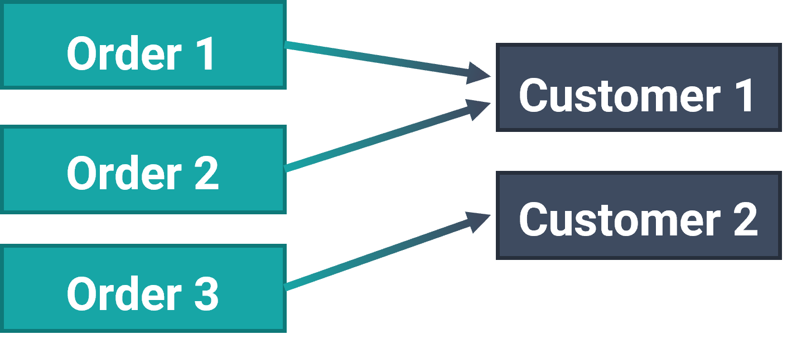
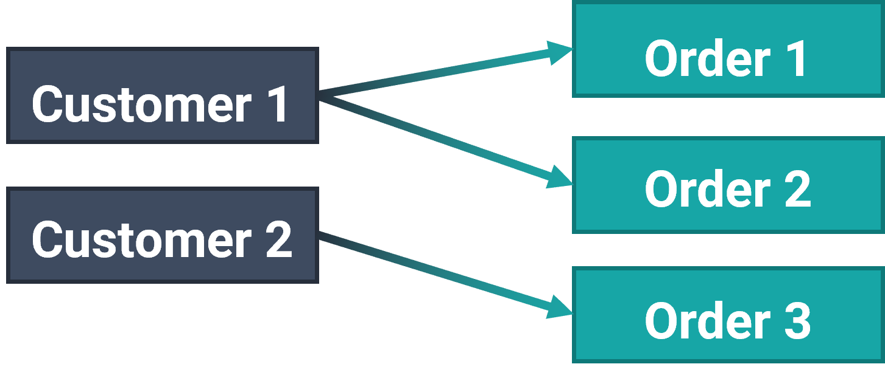

# Relations

## ObjectBox - Relations


Prefer to dive right into code? Check out our

* [Kotlin Android example app](https://github.com/objectbox/objectbox-examples/tree/main/android-app-kotlin) using relations,
* [Java relations playground](https://github.com/objectbox/objectbox-examples/tree/main/android-app-relations) Android app,
* [Flutter relations example](https://github.com/objectbox/objectbox-dart/tree/main/objectbox/example/flutter/objectbox\_demo\_relations) app.



The Python API does not yet support relations.


Objects may reference other objects, for example using a simple reference or a list of objects. In database terms, we call those references **relations**. The object defining a relation we call the **source** object, the referenced object we call the **target** object. So a relation has a direction.

If there is one target object, we call the relation **to-one.** And if there can be multiple target objects, we call it **to-many**. Relations are lazily initialized: the actual target objects are fetched from the database when they are first accessed. Once the target objects are fetched, they are cached for further accesses.

## To-One Relations

<figure><figcaption><p>To-one Relations</p></figcaption></figure>

You define a to-one relation using the `ToOne` class, a smart proxy to the target object. It gets and caches the target object transparently. For example, an order is typically made by one customer. Thus, we could model the  `Order` class to have a to-one relation to the `Customer` like this:



```java
// Customer.java
@Entity
public class Customer {
    
    @Id public long id;
    
}

// Order.java
@Entity
public class Order {
    
    @Id public long id;
    
    public ToOne<Customer> customer;
    
}
```



```kotlin
@Entity
data class Customer(
        @Id var id: Long = 0
)

@Entity
data class Order(
        @Id var id: Long = 0
) {
    lateinit var customer: ToOne<Customer>
}
```


For Kotlin desktop (Linux, macOS, Windows) apps, additional code is required. See [#initialization-magic](relations.md#initialization-magic "mention").




```dart
@Entity()
class Customer {
  int id;
}

@Entity()
class Order {
  int id;
  
  final customer = ToOne<Customer>();
}
```



Now let’s add a customer and some orders. **To set** the related customer object, call `setTarget()`  (or assign `target` in Kotlin) on the ToOne instance **and put** the order object:



```java
Customer customer = new Customer();
Order order = new Order();
order.customer.setTarget(customer);
// Puts order and customer:
long orderId = boxStore.boxFor(Order.class).put(order);
```



```kotlin
val customer = Customer()
val order = Order()
order.customer.target = customer
// Puts order and customer:
val orderId = boxStore.boxFor(Order::class.java).put(order)
```



```dart
final customer = Customer();
final order = Order();

// set the relation
order.customer.target = customer;
// Or you could create the target object in place:
// order.customer.target = Customer();

// Save the order and customer to the database
int orderId = store.box<Order>().put(order);
```



If the customer object does not yet exist in the database (i.e. its ID is zero), `ToOne` will put it (so there will be two puts, one for `Order`, one for `Customer`). If it already exists, `ToOne` will only create the relation (so there's only one put for `Order`, as explicitly written in the code). **See further below for details about** [**updating relations**](relations.md#updating-relations)**.**


**Note:** if your related entity uses self-assigned IDs with `@Id(assignable = true)` ObjectBox won't know if a target object is a new one or an existing one, therefore it will NOT insert it, you would have to call `customerBox.put(customer)`manually (considering the previous example). See below about [updating ToOne](relations.md#updating-toone) for details.


Have a look at the following code how you can **get** (read) the customer of an order:



```java
Order order = boxStore.boxFor(Order.class).get(orderId);
Customer customer = order.customer.getTarget();
```



```kotlin
val order = boxStore.boxFor(Order::class.java)[orderId]
val customer = order.customer.target
```



```dart
final order = store.box<Order>().get(orderId);
final customer = order.customer.target;
```



This will do a database call on the first access (lazy loading). It uses lookup by ID, which is very fast in ObjectBox. If you only need the ID instead of the whole target object, you can completely avoid this database operation because it's already loaded: use `order.customer.targetId/getTargetId()`.

We can also **remove** the relationship to a customer:



```java
order.customer.setTarget(null);
boxStore.boxFor(Order.class).put(order);
```



```kotlin
order.customer.target = null
boxStore.boxFor(Order::class.java).put(order)
```



```dart
order.customer.target = null; // same as  .targetId = 0;
store.box<Order>().put(order);
```



Note that this does not remove the customer from the database, it just dissolves the relationship.

### How ToOne works behind the scenes

If you look at your model in `objectbox-models/default.json` (or `lib/bjectbox-model.json` in Dart) you can see, a ToOne property is not actually stored. Instead, the ID of the target object is saved in a virtual property named like the ToOne property appended with _Id_.

### Expose the ToOne target ID property


Only Java/Kotlin


You can directly access the target ID property by defining a `long` (or `Long` in Kotlin) property in your entity class with the expected name:



```java
@Entity
public class Order {
    @Id public long id;
    
    public long customerId; // ToOne target ID property
    public ToOne<Customer> customer;
}
```



```kotlin
@Entity
data class Order(
        @Id var id: Long = 0,
        var customerId: Long = 0
) {
    lateinit var customer: ToOne<Customer>
}
```



You can change the name of the expected target ID property by adding the [@TargetIdProperty(String)](https://objectbox.io/files/objectbox-java/current/io/objectbox/annotation/TargetIdProperty.html) annotation to a ToOne.

## Initialization Magic


Only Java/Kotlin


Did you notice that the `ToOne` field `customer` was never initialized in the code example above? Why can the code still use `customer` without any NullPointerException? Because the field actually is initialized – the initialization code just is not visible in your sources.

**The ObjectBox Gradle plugin will transform your entity class (supported for Android projects and Java JVM projects)** to do the proper initialization in constructors before your code is executed. Thus, even in your constructor code, you can just assume `ToOne`  and `ToMany`/ `List`  properties have been initialized and are ready for you to use.


**If your setup does not support transformations**, currently **Kotlin JVM** (Linux, macOS, Windows) projects, **add the below modifications** yourself. You also will have to call `box.attach(entity)` before modifying ToOne or ToMany properties.




```java
@Entity
public class Example {
​    
    // Initialize ToOne and ToMany manually.
    ToOne<Order> order = new ToOne<>(this, Example_.order);   
    ToMany<Order> orders = new ToMany<>(this, Example_.orders);
 
    // Add a BoxStore field.
    transient BoxStore __boxStore;
    
}
```



```kotlin
@Entity
class Example() {

    // Initialize ToOne and ToMany manually.
    var order = ToOne<Order>(this, Example_.order)   
    var orders = ToMany<Order>(this, Example_.orders)

    // Add a BoxStore field.
    @JvmField
    @Transient
    @Suppress("PropertyName")
    var __boxStore: BoxStore? = null

}
```



## Improve Performance


Only Java/Kotlin


To improve performance when ObjectBox constructs your entities, you should **provide an all-properties constructor**.

For a ToOne you have to add an id parameter, typically named like the ToOne field appended with `Id` . Check your `objectbox-models/default.json`  file to find the correct name.

An example:

```java
@Entity
public class Order {
    
    @Id public long id;
    
    public ToOne<Customer> customer;
    
    public Order() { /* default constructor */ }
    
    public Order(long id, long customerId /* virtual ToOne id property */) {
        this.id = id;
        this.customer.setTargetId(customerId);
    }
    
}
```

## To-Many Relations

To define a to-many relation, you can use a property of type `ToMany`. As the ToOne class, the `ToMany`  class helps you to keep track of changes and to apply them to the database.

Note that **to-many relations are resolved lazily** on first access, and then **cached** in the source entity inside the `ToMany` object. So subsequent calls to any method, like `size()` of the `ToMany`, do not query the database, even if the relation was changed elsewhere. To get the latest data fetch the source entity again or call `reset()` on the `ToMany`.

There is a slight difference if you require a one-to-many (1:N) or many-to-many (N:M) relation. A 1:N relation is like the example above where a customer can have multiple orders, but an order is only associated with a single customer. An example for an N:M relation is students and teachers: students can have classes by several teachers but a teacher can also instruct several students.

### One-to-Many (1:N)

<figure><figcaption><p>One-to-Many (1:N)</p></figcaption></figure>

To define a one-to-many relation, you need to annotate your relation property with `@Backlink`. It links back to a to-one relation in the target object. Using the customer and orders example, we can modify the customer class to have a to-many relation to the customer's orders:



```java
// Customer.java
@Entity
public class Customer {
    
    @Id public long id;
    
    @Backlink(to = "customer")
    public ToMany<Order> orders;
    
}

// Order.java
@Entity
public class Order {
    
    @Id public long id;
    public String name;
    
    public ToOne<Customer> customer;
    
    public Order(String name) {
        this.name = name;
    }
    
    public Order() {
    }
}
```



```kotlin
@Entity
data class Customer(
        @Id var id: Long = 0
) {    
    @Backlink(to = "customer")
    lateinit var orders: ToMany<Order>
}

@Entity
data class Order(
        @Id var id: Long = 0,
        var name: String? = ""
) {
    lateinit var customer: ToOne<Customer>
}
```


For Kotlin desktop (Linux, macOS, Windows) apps, additional code is required. See [#initialization-magic](relations.md#initialization-magic "mention").




```dart
@Entity()
class Customer {
  int id;

  @Backlink('customer')
  final orders = ToMany<Order>();
}

@Entity()
class Order {
  int id;

  final customer = ToOne<Customer>();
}
```




When using `@Backlink` it is recommended to explicitly specify the linked to relation using `to`. It is possible to omit this if there is only one matching relation. However, it helps with code readability and avoids a compile-time error if at any point another matching relation is added (in the above case, if another `ToOne<Customer>` is added to the Order class).


Let’s **add** some orders together with a new customer. `ToMany` implements the Java List interface, so we can simply add orders to it:



```java
Customer customer = new Customer();
customer.orders.add(new Order("Order #1"));
customer.orders.add(new Order("Order #2"));
// Puts customer and orders:
long customerId = boxStore.boxFor(Customer.class).put(customer);
```



```kotlin
val customer = Customer()
customer.orders.add(Order("Order #1"))
customer.orders.add(Order("Order #2"))
// Puts customer and orders:
val customerId = boxStore.boxFor(Customer::class.java).put(customer)
```


Two data classes that have the same property values (excluding those defined in the class body) [are equal and have the same hash code](https://kotlinlang.org/docs/reference/data-classes.html). Keep this in mind when working with `ToMany` which uses a `HashMap` to keep track of changes. E.g. adding the same data class multiple times has no effect, it is treated as the same entity.




```dart
Customer customer = Customer();
customer.orders.add(Order()); // Order #1
customer.orders.add(Order()); // Order #2
// Puts customer and orders:
final customerId = store.box<Customer>().put(customer);
```



If the order entities do not yet exist in the database, `ToMany` will put them. If they already exist, it will only create the relation (but not put them). See further below for details about [updating relations](relations.md#updating-relations).


**Note:** if your entities use self-assigned IDs with `@Id(assignable = true)` the above will not work. See below about [updating ToMany](relations.md#updating-tomany) for details.


We can easily **get** the orders of a customer back by accessing the list of orders:



```java
Customer customer = boxStore.boxFor(Customer.class).get(customerId);
for (Order order : customer.orders) {
    // Do something with each order.
}
```



```kotlin
val customer = boxStore.boxFor(Customer::class.java).get(customerId)
for (order in customer.orders) {
    // Do something with each order.
}
```



```dart
Customer customer = store.box<Customer>().get(customerId);
// you can use any List<> functions, for example:
final valueSum = customer.orders.fold(0, (sum, order) => sum + order.value);
// though you could use property queries and their .sum() function for that
```



**Removing** orders from the relation works as expected:



```java
// Remove the relation to the first order in the list
Order order = customer.orders.remove(0);
boxStore.boxFor(Customer.class).put(customer);
// Optional: also remove the order entity from its box:
// boxStore.boxFor(Order.class).remove(order);
```



```kotlin
// Remove the relation to the first order in the list
val order = customer.orders.removeAt(0)
boxStore.boxFor(Customer::class.java).put(customer)
// Optional: also remove the order entity from its box:
// boxStore.boxFor(Order::class.java).remove(order)
```



```dart
// Remove the relation to the first order in the list
Order order = customer.orders.removeAt(0);
store.box<Customer>().put(customer);
// Optional: also remove the order entity from its box:
// store.box<Order>().remove(order);
```



### Many-to-Many (N:M)

<figure><figcaption><p>Many-to-Many (N:M)</p></figcaption></figure>

To define a many-to-many relation you simply add a property using the `ToMany` class. Assuming a students and teachers example, this is how a simple student class that has a to-many relation to teachers can look like:



```java
// Teacher.java
@Entity
public class Teacher{
    
    @Id public long id;
    public String name;
    
    public Teacher(String name) {
        this.name = name;
    }
    
    public Teacher() {
    }
}

// Student.java
@Entity
public class Student{
    
    @Id public long id;
    
    public ToMany<Teacher> teachers;
    
}
```



```kotlin
@Entity
data class Teacher(
        @Id var id: Long = 0,
        var name: String? = ""
)

@Entity
data class Student(
        @Id var id: Long = 0
) {
    lateinit var teachers: ToMany<Teacher>
}
```


For Kotlin desktop (Linux, macOS, Windows) apps, additional code is required. See [#initialization-magic](relations.md#initialization-magic "mention").




```dart
@Entity()
class Teacher{
  int id;
}

@Entity()
class Student{
  int id;
  
  final teachers = ToMany<Teacher>();
}
```



**Adding** the teachers of a student works exactly like with a list:



```java
Teacher teacher1 = new Teacher("Teacher 1");
Teacher teacher2 = new Teacher("Teacher 2");

Student student1 = new Student();
student1.teachers.add(teacher1);
student1.teachers.add(teacher2);

Student student2 = new Student();
student2.teachers.add(teacher2);

// Puts students and teachers:
boxStore.boxFor(Student.class).put(student1, student2);
```



```kotlin
val teacher1 = Teacher("Teacher 1")
val teacher2 = Teacher("Teacher 2")

val student1 = Student()
student1.teachers.add(teacher1)
student1.teachers.add(teacher2)

val student2 = Student()
student2.teachers.add(teacher2)

// Puts students and teachers:
boxStore.boxFor(Student::class.java).put(student1, student2)
```



```dart
Teacher teacher1 = Teacher();
Teacher teacher2 = Teacher();

Student student1 = Student();
student1.teachers.add(teacher1);
student1.teachers.add(teacher2);

Student student2 = Student();
student2.teachers.add(teacher2);

// saves students as well as teachers in the database
store.box<Student>().putMany([student1, student2]);
```



If the teacher entities do not yet exist in the database, `ToMany` will also put them. If they already exist,  `ToMany` will only create the relation (but not put them). See further below for details about [updating relations](relations.md#updating-relations).


**Note:** if your entities use self-assigned IDs with `@Id(assignable = true)` the above will not work. See below about [updating ToMany](relations.md#updating-tomany) for details.


To **get** the teachers of a student we just access the list:



```java
Student student = boxStore.boxFor(Student.class).get(studentId);
for (Teacher teacher : student.teachers) {
    // Do something with each teacher.
}
```



```kotlin
val student = boxStore.boxFor(Student::class.java).get(studentId)
for (teacher in student.teachers) {
    // Do something with each teacher.
}
```



```dart
Student student = store.box<Student>().get(studentId);
// you can use any List<> functions, for example:
student.teachers.forEach((Teacher teacher) => ...);
```



And if a student drops out of a class, we can **remove** a teacher from the relation:



```java
student.teachers.remove(0);
// Simply put the student again:
// boxStore.boxFor(Student.class).put(student);
// Or more efficient (than writing the thole object), store just the relations:
student.teachers.applyChangesToDb();
```



```kotlin
student.teachers.removeAt(0)
// Simply put the student again:
// boxStore.boxFor(Student::class.java).put(student)
// Or more efficient (than writing the thole object), store just the relations:
student.teachers.applyChangesToDb()
```



```dart
student.teachers.removeAt(0)
// Simply put the student again:
// store.box<Student>().put(student);
// Or more efficient (than writing the thole object), store just the relations:
student.teachers.applyToDb();
```



#### Access Many-To-Many in the reverse direction

Following the above example, you might want an easy way to find out what students a teacher has. Instead of having to perform a query, you can just add a to-many relation to the teacher and annotate it with the `@Backlink` annotation:



```java
// Teacher.java
@Entity
public class Teacher{
    
    @Id public long id;
    
    // Backed by the to-many relation in Student:
    @Backlink(to = "teachers")
    public ToMany<Student> students;
    
}

// Student.java
@Entity
public class Student{
    
    @Id public long id;
    
    public ToMany<Teacher> teachers;
    
}
```



```kotlin
@Entity
data class Teacher(
        @Id var id: Long = 0
) {
    // Backed by the to-many relation in Student:
    @Backlink(to = "teachers")
    lateinit var students: ToMany<Student>
}

@Entity
data class Student(
        @Id var id: Long = 0
) {
    lateinit var teachers: ToMany<Teacher>
}
```


For Kotlin desktop (Linux, macOS, Windows) apps, additional code is required. See [#initialization-magic](relations.md#initialization-magic "mention").




```dart
@Entity()
class Teacher{
  int id;
  
  // Backed by the to-many relation in Student:
  @Backlink()
  final students = ToMany<Student>();
}

@Entity()
public class Student{
  int id;
  
  final teachers = ToMany<Teacher>();
}
```



### Using the List interface for to-many


Only for Java/Kotlin


Instead of the `ToMany` type it is also possible to use `List` (or `MutableList` in Kotlin) for a to-many property. At runtime the property will still be a `ToMany` instance (`ToMany` does implement the `List` interface) due to the initialization magic described above, or if manually initialized as seen in the example below.



```java
// Teacher.java
@Entity
public class Teacher{    
    @Id public long id;    
}

// Student.java
@Entity
public class Student{    
    @Id public long id;    
    public List<Teacher> teachers = new ToMany<>(this, Student_.teachers);   
}
```



```kotlin
@Entity
data class Teacher(
        @Id var id: Long = 0
)

@Entity
data class Student(
        @Id var id: Long = 0
) {
    var teachers: MutableList<Teacher> = ToMany<>(this, Student_.teachers)
}
```




This may be helpful when trying to deserialize an object that contains a to-many from JSON. However, note that if the JSON deserializer replaces the `ToMany` instance with e.g. an `ArrayList` during put the to-many property is skipped. It is then up to you to create the relation.


```java
Box<Student> studentBox = store.boxFor(Student.class);
Student student = new Student();
Teacher teacher = new Teacher();

// Simulate what a JSON deserialzer would do:
// replace ToMany instance with ArrayList.
student.teachers = new ArrayList();
student.teachers.add(teacher);
// Put will skip the teachers property.
studentBox.put(student);
System.out.println(store.boxFor(Teacher.class).count());
// prints 0

// Need to manually create the relation.
Student student2 = studentBox.get(student.id);
student2.teachers.addAll(student.teachers);
studentBox.put(student2);
```

## Updating Relations

The ToOne and ToMany relation classes assist you to persist the relation state. They keep track of changes and apply them to the database once you **put the Object containing them**. ObjectBox supports relation updates for new (not yet persisted; ID == 0) and existing (persisted before; ID != 0) Objects.

For convenience, ToOne and ToMany will put Objects added to them if they do **not yet exist** (ID == 0). If they already **exist** (their ID != 0, or you are using `@Id(assignable = true)`), only the relation will be created or destroyed (internally the Object ID is added to or removed from the relation). In that case, to put changes to the properties of related Objects use their specific Box instead:



```java
// update a related entity using its box
Order orderToUpdate = customer.orders.get(0);
orderToUpdate.text = "Revised description";
// DOES NOT WORK
// boxStore.boxFor(Customer.class).put(customer);
// WORKS
boxStore.boxFor(Order.class).put(orderToUpdate);
```



```kotlin
// update a related entity using its box
Order orderToUpdate = customer.orders.getAt(0);
orderToUpdate.text = "Revised description";
// DOES NOT WORK
// boxStore.boxFor(Customer::class.java).put(customer);
// WORKS
boxStore.boxFor(Order::class.java).put(orderToUpdate);
```



```dart
// update a related entity using its box
Order orderToUpdate = customer.orders[0];
orderToUpdate.text = 'Revised description';
// DOES NOT WORK - the change to the order is not saved
// store.box<Customer>().put(customer);
// WORKS
store.box<Order>().put(orderToUpdate);
```



### Updating ToOne

The ToOne class offers the following methods to update the relation:

* `setTarget(target)` makes the given (new or existing) Object the new relation target; pass `null` to clear the relation.
* `setTargetId(targetId)` sets the relation target based on the given ID of an existing Object; pass `0` (zero) to clear the relation.
* Java/Kotlin only: `setAndPutTarget(target)` makes the given (new or existing) Object the new relation target and puts the owning, source Object and if needed the target Object.



```java
// Option 1: set target and put.
order.customer.setTarget(customer);
// Or set target via Object ID: 
// order.customer.setCustomerId(customer.getId());
orderBox.put(order);

// Option 2: combined set target and put.
order.customer.setAndPutTarget(customer);
```



```kotlin
// Option 1: set target and put.
order.customer.setTarget(customer)
// Or set target via Object ID: 
// order.customer.setCustomerId(customer.getId())
orderBox.put(order)

// Option 2: combined set target and put.
order.customer.setAndPutTarget(customer)
```




**Note:** attach the Box before calling `setAndPutTarget()` on a new (not put) Object owning a ToOne:

```java
Order order = new Order();
orderBox.attach(order);
order.customer.setAndPutTarget(customer);
```



**Note:** if the target Object uses self-assigned IDs with  `@Id(assignable = true)`it will not be put when the Object that owns the relation is put:

```java
Customer customer = new Customer();
// If ID is self-assigned, put target Object first
customer.id = 12;
customerBox.put(customer);
// Then can safely set as target
order.customer.setTarget(customer);
// Or set target via Object ID
// order.customer.setCustomerId(customer.getId());
orderBox.put(order);
```

This is because **ObjectBox only puts related entities with an ID of 0**. See the [documentation about IDs](advanced/object-ids.md) for background information.


### Updating ToMany

The `ToMany` relation class is based on a standard `List` with added change tracking for Objects. As [mentioned above](relations.md#updating-relations), it will put new Objects (ID == 0) that are added to it once the Object owning it is put. And when removing Objects from it, just the relation is cleared, the Objects are not removed from their Box.&#x20;

See the documentation on [One-to-Many](relations.md#one-to-many-1-n) and [Many-to-Many](relations.md#many-to-many-n-m) above for details.


**Note (Java/Kotlin only):** if your entities are using self-assigned IDs with  `@Id(assignable = true)` additional steps are required. Read on for details:


If the owning, source Object uses `@Id(assignable = true)` attach its Box before modifying its ToMany:

```java
// If source has self-assigned ID attach Box first
customer.id = 12;
customerBox.attach(customer);
// Then can safely modify ToMany
customer.orders.add(order);
customerBox.put(customer);
```

If the target Object, like `Order` above, is using self-assigned IDs put the target Objects before adding them to the ToMany relation:

```java
// If ID is self-assigned put target Object first
order.id = 42;
orderBox.put(order);
// Then can safely add target Object to ToMany
customer.orders.add(order);
customerBox.put(customer);
```

The above steps are required because, when putting the Object owning the ToMany only the relation is updated. This is because **ObjectBox only puts target Objects with an ID of 0**. See the [documentation about IDs](advanced/object-ids.md) for the background information.

## Example: Extending the Model with an Address

A typical extension to the customer/order example we have started earlier would be to add an `Address` type. While you could model street, ZIP and so on directly into `Customer`, it usually makes sense to normalize that out into a separate entity. And when you think about the usual shopping sites, they all let you have multiple addresses...

So, typically, this is how you would model that:

* an address is bound to a customer; add a `ToOne<Customer> customer` to `Address`
* an order is shipped to one address, and might have a diverging billing address optionally; add `ToOne<Address> shippingAddress` and `ToOne<Address> billingAddress` to `Order`
* For each `ToOne` you could have a matching `ToMany` on the other side of the relation (backlink)

## Example: Modelling Tree Relations

You can model a tree relation with a to-one and a to-many relation pointing to itself:



```java
@Entity
public class TreeNode {
    @Id long id;
    
    ToOne<TreeNode> parent;
    
    @Backlink
    ToMany<TreeNode> children;
}
```



```kotlin
@Entity
data class TreeNode(
        @Id var id: Long = 0
) {
    lateinit var parent: ToOne<TreeNode>
    
    @Backlink
    lateinit var children: ToMany<TreeNode>
}
```


For Kotlin desktop (Linux, macOS, Windows) apps, additional code is required. See [#initialization-magic](relations.md#initialization-magic "mention").




This lets you navigate a tree nodes parent and children:



```java
TreeNode parent = treeNode.parent.getTarget();
List<TreeNode> children = treeNode.children;
```



```kotlin
val parent: TreeNode = treeNode.parent.target
val children: List<TreeNode> = treeNode.children
```


